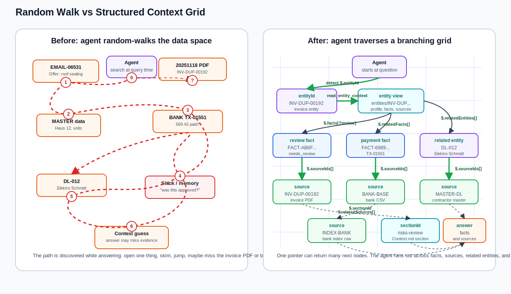
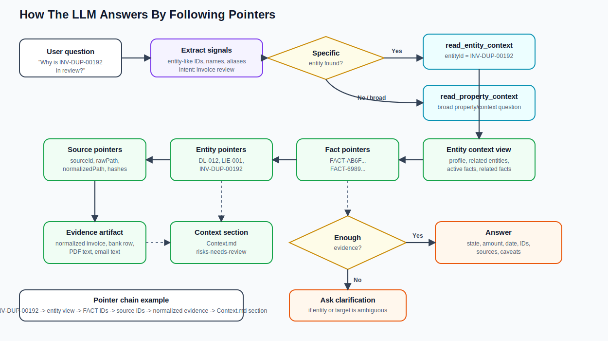
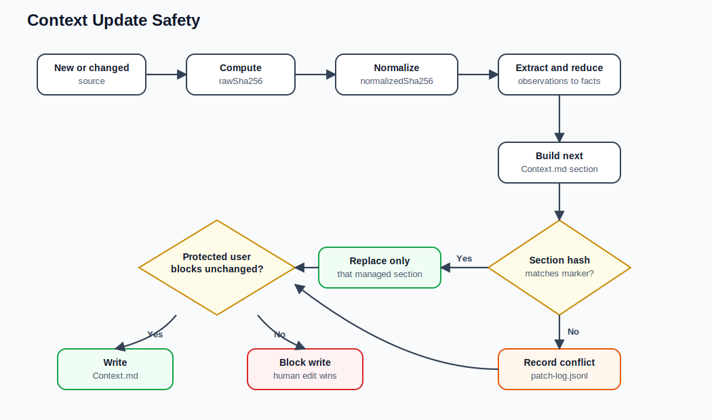
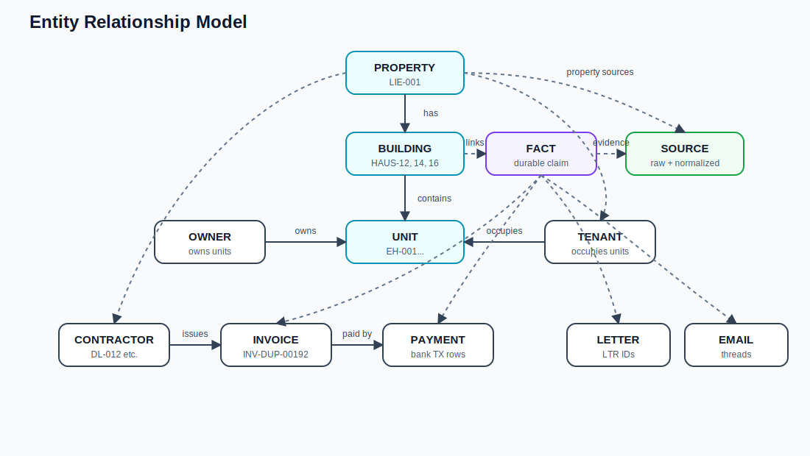

# Buena Property Context Engine

Hackathon prototype for the Big Berlin Hack / Buena property-management context challenge.

This project turns scattered property-management data into a source-backed context map that an agent can traverse, cite, update, and show on screen.

For the full technical implementation, file map, artifact contracts, pipeline details, and production path, see **[`docs/TECHNICAL_IMPLEMENTATION.md`](docs/TECHNICAL_IMPLEMENTATION.md).**

## Output Examples

These screenshots show the working demo output: the agent UI, context/artifact views, graph-style navigation, and streamed context-engine behavior.


## Core Idea

Property-management work is context-heavy. A single question can depend on emails, scanned PDFs, invoices, bank exports, ERP master data, letters, owners, tenants, contractors, and prior human decisions.

The hard part is not only answering one question. The hard part is making sure the agent knows which building, unit, owner, contractor, invoice, payment, and previous decision belong together.

A normal agent usually performs a random walk through this messy data space at question time:

```text
search -> open file -> skim -> guess -> open another file -> repeat
```

We invert that flow.

Instead of making the agent discover context from scratch, ingestion turns raw data into a structured grid of stable coordinates:

```text
sourceId -> normalizedPath -> workItemId -> entityId -> factId -> sectionId
```

Then the agent answers by traversing the grid:

```text
question -> entity coordinate -> fact coordinate -> source evidence -> Context.md section -> answer
```

Think of it like changing the agent from a person searching a messy office into a person using a city map. In the messy office, every answer starts by opening random folders. In the city map, the agent moves from one coordinate to the next.

## Random Walk Vs Structured Grid



The left side is the normal failure mode. The red path is the agent walking from one clue to another: an email, then master data, then a bank row, then memory, then maybe the invoice PDF. Each dot is an event or source the agent had to discover while answering.

The right side is our approach. Ingestion creates a grid before the question is asked. Every source, entity, fact, context section, patch, and correction has a stable coordinate. The arrows are JSON-style pointers. One pointer can return one next node or many next nodes, so the agent can fan out across all relevant evidence instead of reading one file at a time.

In concrete terms:

```text
Random walk:
question -> search "invoice" -> open PDF -> search bank CSV -> skim email -> maybe answer

Structured grid:
question -> INV-DUP-00192
  -> [review fact, payment fact, contractor entity]
  -> [invoice source, bank source, contractor master data]
  -> [normalized evidence, Context.md#risks-needs-review]
  -> answer
```

## What The System Produces

The committed demo context lives in `contexts/LIE-001`:

```text
contexts/LIE-001/
  Context.md
  coverage-report.md
  corrections.jsonl
  entity-index.json
  fact-index.json
  patch-log.jsonl
  source-registry.json
  view-manifest.json
  entities/
    LIE-001.md
    HAUS-12.md
    EIG-001.md
    INV-DUP-00192.md
    ...
```

The important output is not only the chat UI. The important output is the context substrate behind it:

| Artifact | Role |
| --- | --- |
| `source-registry.json` | Raw source inventory with hashes, statuses, normalized paths, ignored files, and provenance. |
| `entity-index.json` | Canonical property, building, unit, owner, tenant, contractor, invoice, letter, email, and transaction entities. |
| `fact-index.json` | Durable facts with evidence, linked entities, decisions, dates, and source IDs. |
| `Context.md` | Dense property-level materialized context view for agents and humans. |
| `entities/*.md` | Scoped entity views for fast lookup of a building, owner, contractor, invoice, etc. |
| `view-manifest.json` | Maps each materialized view to the facts and entities it depends on. |
| `patch-log.jsonl` | Audit trail of `Context.md` section updates and conflicts. |
| `corrections.jsonl` | Proposed human/agent corrections with provenance and target IDs. |
| `coverage-report.md` | Proof that eligible normalized sources were assigned and processed. |

## Ingestion Flow

The ingestion pipeline turns raw files into a traversable map.

In plain language: ingestion reads the messy source world once, cleans it up, links records that belong together, extracts facts, and writes a compact context view the agent can use later.

```text
raw files
  -> inventory scan
  -> raw SHA-256 checksums
  -> source registry
  -> normalized artifacts
  -> work queue
  -> compact glimpses
  -> entity linking
  -> deterministic extraction
  -> Gemini semantic extraction for high-signal unstructured text
  -> observations
  -> fact index
  -> Context.md and entity views
```

What happens at each stage:

| Stage | What it does |
| --- | --- |
| Inventory | Finds files in `data/`, classifies source type, assigns stable `sourceId`, computes `rawSha256`. |
| Normalization | Converts PDFs, CSVs, XML, emails, and master data into predictable artifacts under `workdir/normalized`. |
| Work queue | Groups thousands of sources into bounded work items such as email threads, invoice groups, bank groups, and letter groups. |
| Glimpses | Creates compact summaries with labels, date ranges, metrics, preview fields, and entity hints. |
| Entity linking | Resolves IDs, aliases, emails, filenames, owners, tenants, units, contractors, invoices, and property scope. |
| Extraction | Uses deterministic extraction for structured sources and Gemini only for high-signal unstructured threads. |
| Fact reduction | Converts observations into durable `FACT-*` records with source and evidence pointers. |
| Materialization | Writes `Context.md`, entity views, view manifest, and patch log. |
| Coverage | Checks that eligible normalized sources were assigned and work items reached terminal outcomes. |

Current generated stats from `coverage-report.md`:

```text
Property: LIE-001
Source assignment status: PASS
Sources: 6886
Eligible normalized sources: 6883
Assigned normalized sources: 6883
Work items: 4498
Pending work items: 0
```

`fact-index.json` currently contains `6497` facts.

## Context Map

The context map is the set of stable coordinates the agent can traverse.

Each coordinate answers one question: where did this come from, what does it describe, what entity does it belong to, what fact did we extract, and where should the agent look next?

```text
sourceId        original source identity, such as INV-DUP-00192
rawPath         original path under data/
rawSha256       checksum of the raw source
normalizedPath  extracted/normalized artifact path
normalizedSha256 checksum of the normalized artifact
workItemId      grouped processing unit
inputHash       extraction input hash for reuse and audit
entityId        canonical entity ID, such as HAUS-12 or DL-012
factId          durable fact ID
sectionId       Context.md section ID, such as risks-needs-review
patchId         section update record
correctionId    proposed human/agent correction record
```

Example pointer chain:

```text
INV-DUP-00192
  -> contexts/LIE-001/entities/INV-DUP-00192.md
  -> FACT-AB6F0F48906AD2B1
  -> sourceIds: [INV-DUP-00192]
  -> normalizedPath: workdir/normalized/invoices/INV-DUP-00192.md
  -> Context.md#risks-needs-review
```

This is the main design bet: do not make the agent find context. Build a context map it can use.

## How The Agent Answers



The LLM does not need to memorize the property. It acts more like a navigator. It chooses which context tool to use, follows stable pointers, and stops when it has enough evidence.

Answer flow:

| Step | What happens |
| --- | --- |
| 1 | The question is scanned for explicit IDs, names, invoice numbers, contractor names, emails, unit IDs, and intent. |
| 2 | If a specific entity is detected, the agent reads `contexts/LIE-001/entities/<entityId>.md`. |
| 3 | If the question is broad, the agent reads `contexts/LIE-001/Context.md`. |
| 4 | The agent follows fact IDs, related entity IDs, source IDs, normalized paths, and section IDs. |
| 5 | If enough evidence exists, the answer cites state, dates, amount, entities, fact IDs, and source IDs. |
| 6 | If the target is ambiguous, the agent asks a short clarification question instead of guessing. |

Example question:

```text
Why is INV-DUP-00192 in review, and what payment is related to it?
```

Traversal:

```text
detected entityId: INV-DUP-00192
  -> read entity context
  -> find review fact FACT-AB6F0F48906AD2B1
  -> find related payment fact FACT-6989CE6E7698B417
  -> follow contractor entity DL-012
  -> follow source IDs to invoice and bank evidence
  -> check Context.md#risks-needs-review
  -> answer with amount, date, contractor, review state, and source IDs
```

## How Updates Work



When new daily data arrives, it goes through the same grid-building pipeline. The system compares hashes and facts, then patches only the affected views.

Update guarantees:

| Mechanism | Why it matters |
| --- | --- |
| `rawSha256` | Detects whether the original source changed. |
| `normalizedSha256` | Detects whether the extracted normalized artifact changed. |
| `inputHash` | Lets extraction reuse previous semantic/deterministic results when inputs are unchanged. |
| stable `FACT-*` IDs | Makes fact diffs and view dependencies possible. |
| BCE section hashes | Prevents silent overwrite of manually changed `Context.md` sections. |
| protected `<user>` blocks | Human-confirmed context survives regeneration. |
| `patch-log.jsonl` | Records applied section updates and conflicts. |
| `view-manifest.json` | Shows which views depend on which facts and entities. |

`Context.md` is not overwritten as one giant blob. It is split into managed sections:

```md
<!-- BCE:SECTION risks-needs-review START hash=... -->
## Risks / Needs Review
...
<!-- BCE:SECTION risks-needs-review END -->
```

If a section hash matches, the system can patch that section. If the hash does not match, it records a conflict instead of destroying human edits.

## Human Edits And Corrections

The UI allows humans to edit `Context.md`. Direct edits are wrapped in protected blocks:

```md
<user id="USEREDIT-..." author="frontend-user" created_at="..." action="insert">
Human-confirmed correction or note.
</user>
```

Rules:

| Rule | Behavior |
| --- | --- |
| Human blocks are protected | Regeneration must preserve them exactly. |
| Generated facts are not silently changed by chat | The agent records proposed corrections in `corrections.jsonl`. |
| Agent notes live outside managed sections | Notes survive regeneration without corrupting source-backed sections. |
| Conflicts are explicit | If generated facts and human edits disagree, the system records a conflict or proposed correction. |

## Knowledge Graph



The graph is built from `entity-index.json` and `fact-index.json`.

It connects:

```text
property -> buildings -> units
owners -> units
tenants -> units
contractors -> invoices -> payments
emails / letters / facts -> entities -> sources
```

This makes the UI graph more than a visualization. It is a view over the same IDs and relationships the agent uses to answer.

## Why This Is Not Just RAG

| Basic RAG | This context engine |
| --- | --- |
| Retrieves chunks when asked. | Builds source-backed facts before questions arrive. |
| Often has weak identity resolution. | Maintains canonical `entityId` and aliases. |
| Usually cites documents or chunks. | Cites `factId`, `entityId`, `sourceId`, `normalizedPath`, and `sectionId`. |
| Human corrections are difficult to preserve. | Uses protected `<user>` blocks and `corrections.jsonl`. |
| Regeneration can overwrite useful context. | Uses managed-section hashes and patch logs. |
| Debugging is prompt/log based. | Debugging follows structured artifacts and stable pointers. |

## What To Inspect First

| Path | Why it matters |
| --- | --- |
| `contexts/LIE-001/Context.md` | Property-level materialized context. |
| `contexts/LIE-001/entities/INV-DUP-00192.md` | Scoped invoice context with review state and related payment. |
| `contexts/LIE-001/fact-index.json` | Durable facts and evidence pointers. |
| `contexts/LIE-001/entity-index.json` | Canonical entity graph. |
| `contexts/LIE-001/source-registry.json` | Raw-to-normalized provenance and checksums. |
| `contexts/LIE-001/patch-log.jsonl` | Section update history. |
| `contexts/LIE-001/corrections.jsonl` | Proposed corrections with provenance. |
| `contexts/LIE-001/coverage-report.md` | Assignment and processing proof. |

## Run Locally

Install dependencies:

```bash
npm install
cp .env.example .env
```

Configure `.env`:

```bash
GEMINI_API_KEY=...
GEMINI_MODEL=gemini-1.5-flash
TAVILY_API_KEY=...
GRADIUM_API_KEY=...
```

Start the app:

```bash
npm run dev
```

Useful routes:

```text
/        project overview
/ingest  historic and incremental ingest controls
/chat    agent chat, graph, Context.md preview/editing, voice controls
```

## Rebuild Context Artifacts

```bash
npm run context:ingest:base
npm run context:ingest
npm run context:ingest:latest
npm run context:simulate-incremental
```

## Build And Checks

```bash
npm run build
npx tsc --noEmit --target ES2022 --module ESNext --moduleResolution Bundler --esModuleInterop --skipLibCheck server/index.ts
```

## Design Summary

The project is a context engine, not just a chatbot.

It changes the agent experience from:

```text
search, open, skim, hope, repeat
```

to:

```text
entity -> fact -> source -> evidence -> context section -> answer or correction
```

The agent becomes faster and more trustworthy because context is prepared before the question arrives, while still preserving provenance, checksums, human edits, and source-backed evidence.
